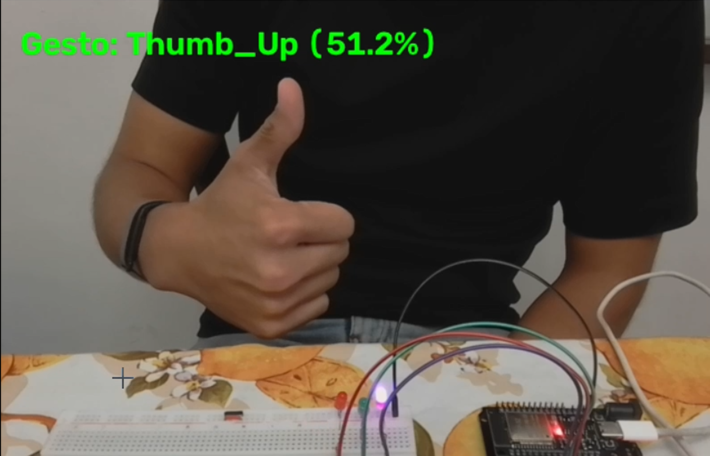
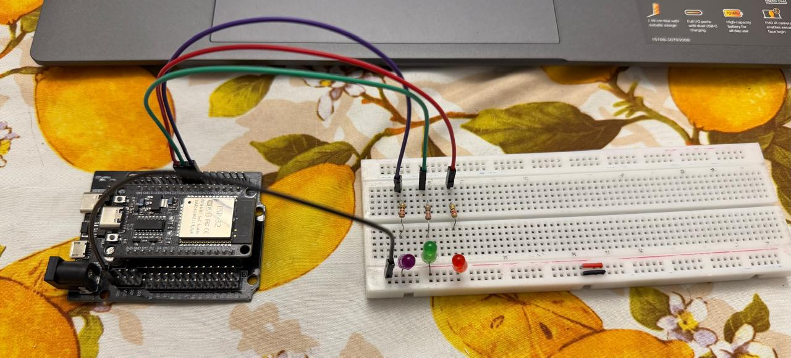

# Control de LEDs con gestos de mano (MediaPipe + ESP32)

Proyecto que reconoce gestos de la mano en tiempo real con la cámara del computador usando MediaPipe y OpenCV (Python), y envía comandos por puerto serie a un ESP32 que controla 3 LEDs con PWM (brillo variable) y dos secuencias animadas.

## Demostración

**Video de funcionamiento:**

[](docs/ACTIVIDAD4_VIDEO.mp4)

> Si el video no se reproduce directamente en GitHub, descárgalo desde [`docs/ACTIVIDAD4_VIDEO.mp4`](docs/ACTIVIDAD4_VIDEO.mp4) o revisa el enlace alternativo: `https://youtu.be/I6osqxRtGYg`.

**Montaje físico:**




## Funcionalidades

| Gesto (MediaPipe) | Comando serie | Acción en los 3 LEDs |
|---|---|---|
| Closed_Fist | `F` | Brillo al 30% |
| Victory | `V` | Brillo al 70% |
| Open_Palm | `P` | Brillo al 100% |
| Thumb_Up | `U` | Secuencia 1: chase (LED1 -> LED2 -> LED3, cada 200 ms) |
| Thumb_Down | `D` | Secuencia 2: parpadeo simultáneo tipo alarma (cada 300 ms) |

## Funcionamiento general

```
Cámara --> Python (OpenCV + MediaPipe) --> Serial (115200 baud) --> ESP32 --> 3 LEDs (PWM)
```

1. Python captura el video y clasifica el gesto con el modelo `gesture_recognizer.task`.
2. Si el gesto cambia, envía un solo carácter por el puerto serie, para no saturar el buffer.
3. El ESP32 interpreta el carácter y ajusta el brillo o inicia una secuencia sin usar `delay()` (con `millis()`), de modo que puede seguir leyendo nuevos comandos mientras anima los LEDs.

## Requisitos

### Hardware
- 1 ESP32 (DevKit v1 de 38 pines o similar)
- 3 LEDs
- 3 resistencias de 220 Ω a 330 Ω
- Protoboard y cables
- Cable USB (datos)
- Cámara web

### Software
- Python 3.9 a 3.12
- VS Code con la extensión PlatformIO

## Conexiones

| LED | Pin ESP32 |
|---|---|
| LED 1 | GPIO 25 |
| LED 2 | GPIO 26 |
| LED 3 | GPIO 27 |

Circuito para cada LED:

```
GPIO ---[ 220Ω a 330Ω ]---|>|--- GND
                        (LED: ánodo +, cátodo -)
```

Evitar los pines GPIO 0, 2, 12, 15 (strapping), 6-11 (flash), 34-39 (solo entrada) y 1/3, TX0/RX0 (usados por el puerto serie).

## Estructura del proyecto

```
.
├── docs/
│   ├── demo.mp4                 # Video de funcionamiento
│   ├── demo-thumbnail.png       # Miniatura del video
│   └── montaje.png              # Imagen del montaje físico
├── python/
│   ├── main.py                  # Reconocimiento de gestos y envío serie
│   └── gesture_recognizer.task  # Modelo de MediaPipe (descargar aparte)
├── esp32/
│   ├── platformio.ini
│   └── src/
│       └── main.cpp             # Firmware del ESP32
└── README.md
```

> Ajusta los nombres de carpetas y archivos según la organización real de tu repositorio.

## Instalación y uso

### 1. Clonar el repositorio

```bash
git clone https://github.com/<tu-usuario>/<tu-repositorio>.git
cd <tu-repositorio>
```

### 2. Cargar el firmware al ESP32

1. Abre la carpeta del firmware (`esp32/`) en VS Code con PlatformIO.
2. Verifica que tu `platformio.ini` sea similar a este:

```ini
[env:esp32dev]
platform = espressif32@6.5.0
board = esp32dev
framework = arduino
monitor_speed = 115200
```

3. Compila y sube el código (botón Upload de PlatformIO o `pio run --target upload`).

Nota sobre la versión del core: el firmware usa la API de PWM clásica (`ledcSetup` y `ledcAttachPin`), compatible con el core Arduino-ESP32 2.x (incluido en `espressif32@6.5.0`). En el core 3.x estas funciones cambian a `ledcAttach(pin, freq, resolución)`.

### 3. Instalar dependencias de Python

```bash
pip install opencv-python mediapipe pyserial
```

### 4. Descargar el modelo de MediaPipe

Descarga `gesture_recognizer.task` y colócalo junto a `main.py`:

```bash
curl -o gesture_recognizer.task https://storage.googleapis.com/mediapipe-models/gesture_recognizer/gesture_recognizer/float16/latest/gesture_recognizer.task
```

### 5. Configurar el puerto serie

En `main.py`, cambia `COM5` por el puerto correspondiente a tu ESP32:

```python
esp32 = serial.Serial('COM5', 115200, timeout=1)
```

- Windows: `COM3`, `COM5`, etc. (ver en Administrador de dispositivos, sección Puertos COM).
- Linux: `/dev/ttyUSB0` o `/dev/ttyACM0`.
- macOS: `/dev/cu.usbserial-XXXX`.

### 6. Ejecutar

```bash
python main.py
```

Se abrirá una ventana con la cámara mostrando el gesto detectado. Presiona `q` para salir.

## Solución de problemas

| Problema | Posible causa o solución |
|---|---|
| `Error al abrir el puerto` | Puerto COM incorrecto o ESP32 desconectado. Verifica el número de puerto. |
| El puerto está ocupado o hay acceso denegado | Cierra el Monitor Serie de PlatformIO o del IDE de Arduino; solo un programa puede usar el puerto a la vez. |
| La cámara detecta el gesto pero los LEDs no reaccionan | Revisa el puerto COM, el cableado, los pines y que el firmware esté cargado correctamente. |
| Error de compilación en `ledcSetup` o `ledcAttach` | Desajuste entre la versión del core y la API de PWM utilizada. Fija la versión en `platformio.ini` (ver paso 2). |
| Los LEDs no encienden | Verifica la polaridad del LED (cátodo a GND), el valor de la resistencia y el pin utilizado. |
| `gesture_recognizer.task` no encontrado | Descarga el modelo (paso 4) y colócalo en la misma carpeta que `main.py`. |
| El ESP32 no responde justo al iniciar | Al abrir el puerto serie el ESP32 se reinicia; el `time.sleep(2)` del script le da tiempo para arrancar antes de enviar comandos. |

## Personalización

- Cambiar gestos o comandos: edita el diccionario `GESTURE_TO_COMMAND` en Python y el `switch` del firmware.
- Cambiar la velocidad de las secuencias: modifica las constantes `intervalo` (200 ms y 300 ms) en `main.cpp`.
- Cambiar los niveles de brillo: ajusta `BRIGHT_30`, `BRIGHT_70` y `BRIGHT_100` (valores de 0 a 255).
- Usar otra cámara: cambia `cv2.VideoCapture(0)` por `1`, `2`, etc., según el índice de dispositivo.

## Tecnologías utilizadas

- MediaPipe Gesture Recognizer
- OpenCV
- PySerial
- PlatformIO y el framework Arduino para ESP32

## Licencia

Este proyecto se distribuye bajo la licencia MIT. Puedes modificarla según tus necesidades.

## Autor

Desarrollado por <Juan David Artunduaga Diaz> — [@JuanD001](https://github.com/JuanD001)
